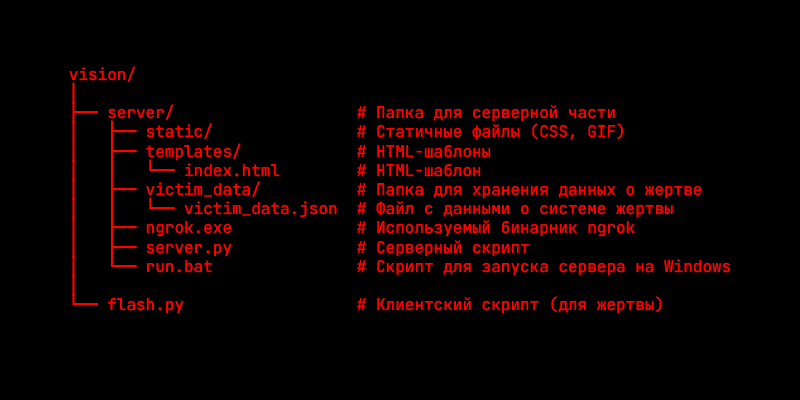

<header>
  

# VISION

_**VISION** - это система мониторинга, предназначенная для удалённого сбора информации о жертве и её видео-трансляции в реальном времени. Сервер принимает данные о системе жертвы, 
а также видео с её камеры. Жертва, в свою очередь, отправляет эту информацию через специальное приложение, работающее на её устройстве._

</header>

## Структура проекта

Проект состоит из двух частей: серверной стороны (для атакующего) и клиентской стороны (для жертвы).

- `server.py` — Серверная часть, которая получает данные о системе жертвы и видеопоток.
- `flash.py` — Клиентская часть, которая собирает информацию о системе и передает её серверу, а также отправляет видеопоток с камеры.
- `victim_data/victim_data.json` — Файл для хранения данных о системе жертвы.
- `ngrok` — Используется для создания туннеля к серверу, чтобы жертва могла подключиться к серверу атакующего.
- `run.bat` — Командный скрипт для автоматического запуска серверной части `server.py` и `ngrok`.

## Необходимые зависимости

- `flask` — Веб-фреймворк для создания серверной части приложения. (Серверная часть)
- `cv2` — Библиотека для работы с изображениями и видео, используемая для захвата и отправки видеопотока с камеры. (Клиентская часть)
- `requests` — Библиотека для отправки HTTP-запросов, используемая для передачи данных между клиентом и сервером. (Клиентская часть)

Команда для установки всех зависимостей.  
`pip install Flask opencv-python requests` 

